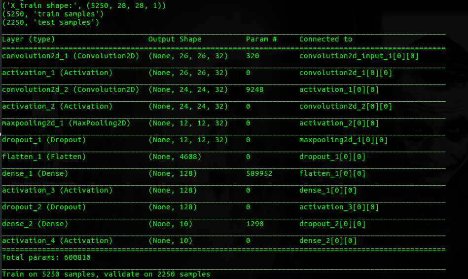
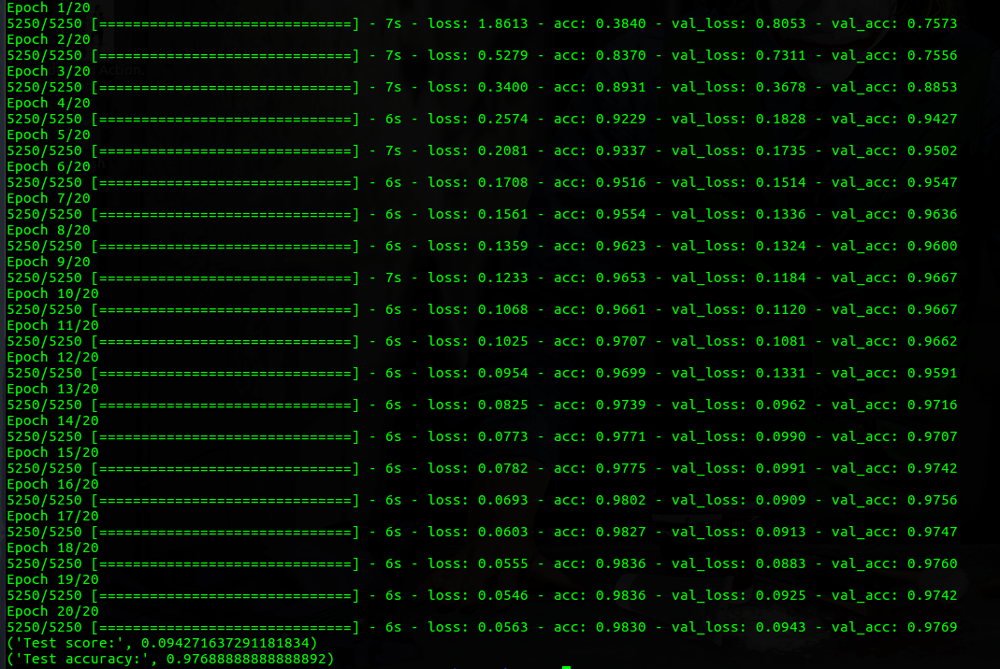

# Bengali-Digit-Classification-CNN-Keras
Bengali Digit Classification Keras implementation of CNN based Model.

# Model Structure

  

# Model Accuracy 

  

# How To Run
1. parse_img.py script parsed all digit and save data on  pickle/img_data.pickle & pickle/img_label.pickle
2. data_reader.py script read saved pickle data
3. cnn-basic.py script hold the model and train processes.
4. Run: python cnn-basic.py
